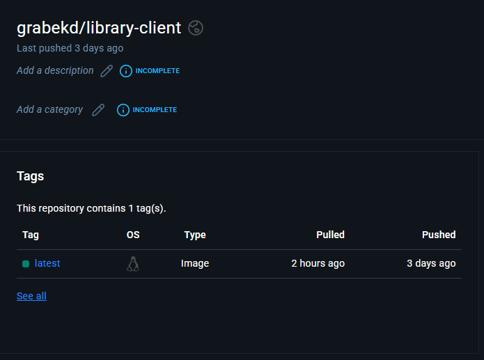
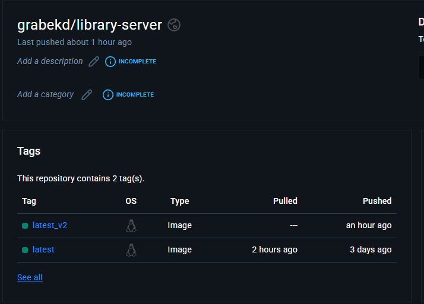
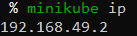
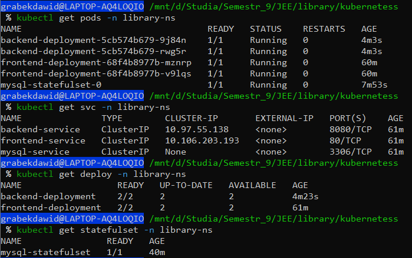
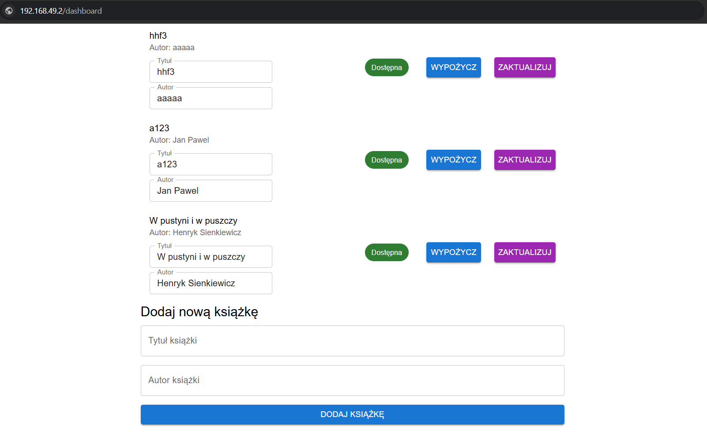
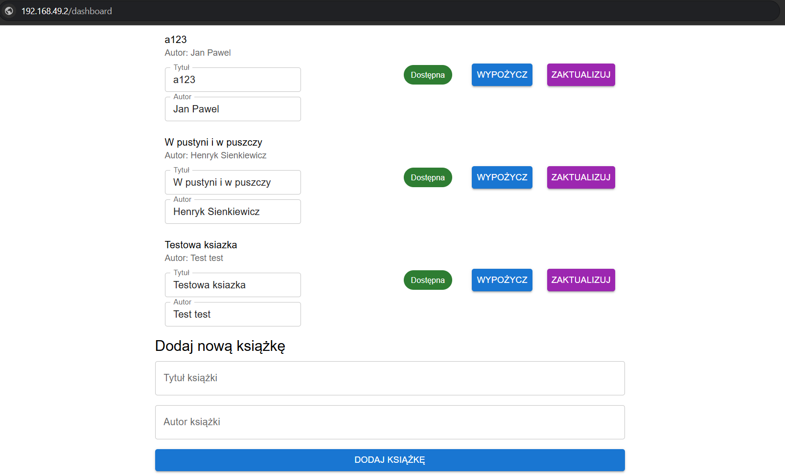

# Wdrożenie aplikacji do zarządzania biblioteką w Kubernetes

Niniejszy dokument opisuje wdrożenie aplikacji do zarządzania biblioteką w środowisku Kubernetes. Aplikacja składa się z backendu w Javie (Spring Boot), frontendu w React oraz bazy danych MySQL. Aplikacja została stworzona jako zaliczenie z przedmiotu `Programowanie aplikacji internetowcyh w JEE` i obsługa Kubernetessa została dodana jako zaliczenie z przedmiotu `Programowanie full-stack w chmurze obliczeniowej`.

## Opis wdrożenia

### 1. Charakterystyka wdrożenia

- **Typ stacka:** Java (Spring Boot) / React / MySQL

### 2. Dostęp do aplikacji

Aplikacje hostuje na dockerhub, utworzyłem 2 obrazy `grabekd/library-client` oraz `grabekd/library-server`, które pobieram przy wdrażaniu aplikacji.

Dostęp do aplikacji z zewnątrz jest realizowany poprzez `Ingress`. Sprawdzam adres IP przez komende `minikube ip` i w drugim oknie włączam tunel `minikube tunnel`.

### 3. Weryfikacja działania

Poprawność wdrożenia można zweryfikować poprzez:

- Sprawdzenie statusu Podów, Deploymentów, Serwisów i StatefulSet.
  
- Przede wszystkim, przetestowanie funkcjonalności aplikacji w przeglądarce (dodawanie i wypożyczanie książek).
  
  

### 4. Pliki

- `namespace.yaml`: Definicja przestrzeni nazw.

- `mysql-secret.yaml`: Secret przechowujący hasło do bazy danych MySQL.

- `mysql-statefulset.yaml`: StatefulSet dla wdrożenia bazy danych MySQL.

- `mysql-service.yaml`: Service dla dostępu do bazy danych MySQL wewnątrz klastra.

- `java-deploy.yaml`: Deployment dla backendu aplikacji Java.

- `java-service.yaml`: Service dla dostępu do backendu Java wewnątrz klastra.

- `frontend-deploy.yaml`: Deployment dla frontendu aplikacji React.

- `frontend-service.yaml`: Service dla dostępu do frontendu React wewnątrz klastra.

- `ingress.yaml`: Ingress umożliwiający dostęp do aplikacji z zewnątrz.

- `network-policy.yaml`: NetworkPolicy definiująca reguły ruchu sieciowego.
